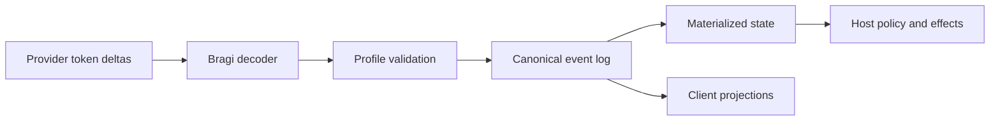
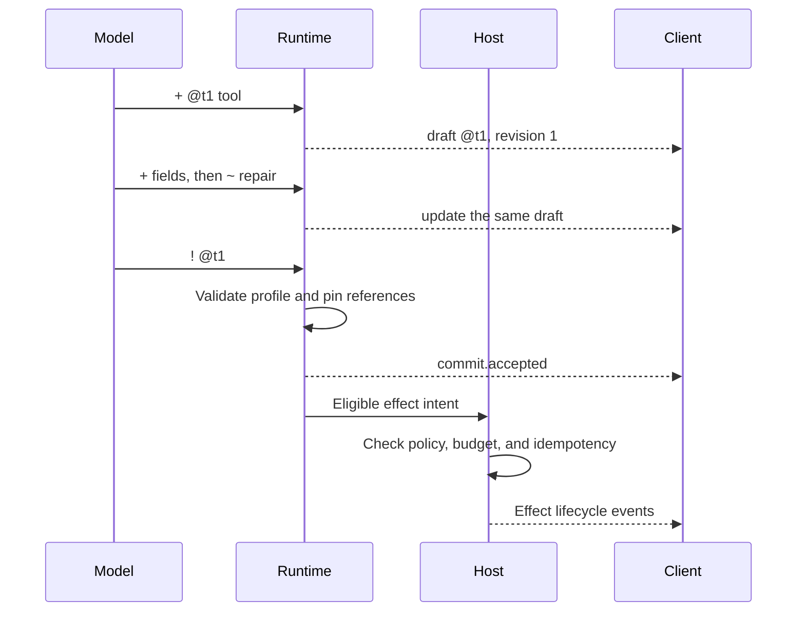

# Bragi

**Let models revise intent before runtimes commit effects.**

Bragi 1.0 is a small, model-native protocol for streaming typed state,
repairing drafts in-band, and explicitly proposing commits while generation is
still in progress. A validating runtime turns the model's source records into
an append-only canonical event log; the runtime, never the model, remains the
authority for side effects and task completion.

Bragi is designed for agent harnesses that want useful partial state without
treating incomplete JSON, provider completion, or model claims as authoritative
workflow state. It is implementation-backed by a Go decoder, profile loader,
materializer, replay path, conformance command, and executable fixtures.

> **Status:** The Bragi 1.x syntax and semantics are stable. Host adoption is
> experimental until the [comparative benchmark gate](docs/benchmark.md)
> passes across at least two model families.

- [Read the normative Bragi 1.0 specification](docs/spec.md)
- [Run the conformance implementation](docs/conformance.md)
- [See complete source streams](examples/)

## The problem

Autoregressive models produce useful information sequentially, but many
structured interfaces become meaningful only after a complete object or tool
call closes. That couples together concerns with different owners and failure
modes:

- model generation and correction;
- schema validation and canonical history;
- authorization of external effects;
- client presentation; and
- workflow completion.

When those concerns share one completion-shaped interface, partial output has
weak semantics, corrections tend to require regeneration or parser inference,
and a provider stop can be mistaken for successful task completion.

Bragi gives the model one narrower job:

> Incrementally construct typed intent, repair it while it is still a draft,
> and explicitly propose the revision that the runtime should validate.

The runtime gives every accepted record a canonical sequence, preserves
rejected records as evidence, materializes the current view, and applies its
own policy before any effect can run.

### Example: a cutoff should not erase useful state

Suppose a model is describing a plan step as one streamed JSON object and the
provider connection ends here:

```json
{
  "type": "plan_step",
  "intent": "Add replay support",
  "acceptance": "The same log produces the same state",
  "status": "in-prog
```

The intent and acceptance text arrived, but the enclosing value never became
valid JSON. A consumer must buffer it, adopt partial-JSON semantics, or ask the
model to generate the object again.

With Bragi, complete records before the cutoff already have defined meaning:

```text
+ @s1 plan_step
+ @s1.intent "Add replay support"
+ @s1.acceptance "The same log produces the same state"
+ @s1.status "in-prog
```

The first three records are accepted into draft `@s1`. The incomplete final
record is diagnostic evidence only and does not mutate the draft. The host can
resume from the last canonical sequence; the model does not need to recreate
the accepted prefix.

### Example: correction should happen before execution

A model may realize that its first command is incomplete only after emitting
it. If a closed tool-call object is also the dispatch boundary, there is no
safe interval in which to revise it.

Bragi keeps the request mutable until an explicit commit proposal:

```text
+ @t1 tool
+ @t1.name "shell.run"
+ @t1.arguments.command "go test ./..."
~ @t1.arguments.command "go test -race ./..."
+ @t1.reason "Check concurrent access before accepting the change"
! @t1
```

Both command values remain in canonical history, while the materialized draft
contains only the replacement. Even after `commit.accepted`, the command is
merely eligible for the host's sandbox, capability, policy, budget, and
idempotency checks. No source line directly runs it.

### Example: partial content should not be misrouted

Streaming content to a client before its speaker, audience, or channel is
known can expose text in the wrong place. The Midgard profile marks those
fields as publication guards:

```text
+ @m1 message
+ @m1.content |
|The deployment contains a security-sensitive migration.
! @m1.content
+ @m1.speaker "assistant"
+ @m1.audience "maintainer"
+ @m1.channel "private-review"
! @m1
```

The runtime may materialize the content immediately, but a projection
withholds it until all routing guards contain accepted, closed values and any
host routing predicate passes. Once publishable, later revisions retain the
same entity identity instead of creating a second message.

### Example: “done” is not evidence that the task is done

A model can request completion:

```text
+ @done1 completion
+ @done1.requested_outcome "done"
! @done1
```

That commit may be perfectly valid Bragi while the task still has a failed
check, unresolved effect, or blocking finding. The host evaluates its own
completion contract and may append a result such as:

```json
{
  "kind": "completion.evaluated",
  "outcome": "incomplete",
  "remaining": ["check:test-race", "finding:data-race"]
}
```

The canonical host result, not provider EOF or the model-authored word
`"done"`, controls lifecycle state.

## The source language

The core language has four primary operators:

```text
+ @t1 tool
+ @t1.name "search"
+ @t1.arguments.query "Qwen 3 benchmarks"
~ @t1.arguments.query "Qwen3.8 local inference benchmarks"
! @t1
```

| Operator | Meaning |
| --- | --- |
| `+` | Create an entity, add a field, or append a stable reference. |
| `~` | Replace an existing draft scalar without rewriting history. |
| `-` | Retract a draft field or collection member. |
| `!` | Seal an open literal or propose an entity revision for commit. |

Entities use session-local stable IDs such as `@t1`. A negotiated
[profile](profiles/midgard-v1.md) declares the available entity types, fields,
mutation rules, effect classes, publication guards, and resource limits.

Large text remains incremental without embedding a nested JSON string:

```text
+ @p1 artifact
+ @p1.kind "patch"
+ @p1.content |
|diff --git a/a.go b/a.go
|--- a/a.go
|+++ b/a.go
|
! @p1.content
! @p1
```

Sealing the literal closes the field. Committing the entity is a separate
operation.

## The protocol model

Bragi keeps six concepts distinct:

| Concept | Purpose |
| --- | --- |
| Source record | One complete model-authored operation ending in LF. |
| Entity | Typed, revisioned state addressed by a stable session-local ID. |
| Profile | The exact negotiated schema and limits for one domain. |
| Commit proposal | A model request to validate one entity revision. |
| Canonical event | A sequenced runtime-owned fact produced during validation. |
| Projection | A client-facing view derived from canonical state. |

Raw provider deltas are not source records. Source records are not canonical
events. Accepted commits are not effect authorization. Projections are not
orchestration state.



## How it works

1. Before generation, the host fixes the protocol version, exact profile and
   fingerprint, limits, and any negotiated extensions.
2. The decoder buffers only an incomplete line or open literal and emits
   complete source records.
3. The materializer atomically accepts or rejects each record. A rejection
   never changes the materialized view.
4. `~` and `-` add corrective history while an entity is still mutable; they
   never rewrite accepted events.
5. `! @id` asks the runtime to validate the current revision. Acceptance pins
   references and makes the revision canonical.
6. For an effectful entity, the host still checks capability, policy, budget,
   idempotency, and current task state before dispatch.
7. Clients consume projections keyed by canonical sequence, entity ID, and
   revision. Replay reconstructs the same accepted state without re-executing
   effects.



## Three authorities

| Authority | Owns |
| --- | --- |
| Model | Draft entities, in-band repairs, tool or human-input requests, findings, and commit proposals. |
| Runtime and host | Canonical sequence, validation, policy, effects, budgets, persistence, phase changes, and completion evaluation. |
| Human | Material scope decisions and explicit acceptance of known residual findings. |

`! @t1` is a proposal, not permission. A `commit.accepted` event means the
entity passed Bragi validation; it does not mean a command ran or a task
finished.

## Bragi and adjacent interfaces

Bragi does not replace provider APIs, native tool calling, JSON, MCP,
WebSocket, or SSE. Those interfaces sit at different boundaries and can be
used together.

| Question | Native tool call or streamed JSON | Bragi source |
| --- | --- | --- |
| Main unit | A provider-defined call or structured value. | An independently validated state operation. |
| Useful partial state | Depends on provider deltas or parsing an incomplete value. | Every accepted record may update the typed view. |
| Correction | Regenerate, patch outside the value, or issue another call. | Append `~` or `-` while the revision is still a draft. |
| Effect boundary | Commonly tied to tool-call closure and host handling. | Explicit commit acceptance, followed by separate host authorization. |
| Truncation | May leave an incomplete structured value. | Accepted records survive; an incomplete final record is not applied. |
| Transport | Provider- or application-defined. | Deliberately unspecified; source and projections use separate bindings. |

This table describes protocol boundaries, not a performance win. Whether
Bragi improves validity, latency, recovery cost, or token use is an open
benchmark question.

## Why the protocol looks this way

### Operations are append-oriented

Models generate left to right. Bragi lets each complete line become a bounded
validation unit and lets corrections append new facts instead of asking a
runtime to reinterpret old bytes.

### Stable IDs replace positions

Entities and collection members use references rather than array indexes.
Corrections therefore retain identity across materialization, presentation,
and replay.

### Drafts and effects have different boundaries

Only uncommitted intent may be revised. Effectful entities become immutable
after acceptance, and replay never re-executes them. A corrected effect uses a
new entity ID and may identify what it supersedes.

### Recovery is closed and auditable

Bragi recovers only structural ASCII casing, CRLF endings, and a missing final
LF after authoritative normal provider completion. Recovery metadata is
canonical evidence. The decoder does not trim whitespace, repair JSON,
fuzzy-match schema names, infer targets, or alter payload content.

### Profiles carry domain meaning

The core grammar does not absorb tool catalogs, coding workflows, or product
policy. A profile supplies domain types and limits and is negotiated by name,
version, and exact-byte fingerprint before generation.

### Model syntax and client transport are separate

The line language is optimized for model emission. Canonical events and
clients may use conventional typed JSON. The optional
[WebSocket binding](docs/websocket-binding.md) projects server-owned events; it
does not leak transport concerns into model syntax.

### Completion is server evidence

Model EOF, provider finish reason, and a committed `completion` entity are
observations. The host evaluates its completion contract and emits the
terminal lifecycle result.

## Trust and safety invariants

- No external effect follows from raw model text or an uncommitted draft.
- Every source record is accepted or rejected atomically.
- Rejected records do not mutate materialized state.
- Canonical history is append-only; repairs change the view, not the past.
- References resolve to specific committed revisions.
- Publication guards may withhold provisional content until routing fields are
  accepted and closed.
- Effect idempotency derives from host and accepted entity identity, not raw
  source text.
- Replay fails on gaps or irreproducible commits instead of guessing.
- Client messages and projections never become canonical state implicitly.

## What Bragi does not do

Bragi 1.0 deliberately does not standardize:

- provider token transport or constrained-decoding APIs;
- RPC, tool discovery, authentication, or capability authorization;
- storage encoding or a universal event database;
- host workflow, planning roles, review policy, or completion criteria;
- client transport, presentation cadence, or UI architecture;
- private chain of thought or arbitrary binary streaming; or
- broad grammar repair and semantic inference.

These boundaries keep the model language small and leave authority with the
systems that can validate and enforce it.

## Try the reference implementation

Bragi currently requires Go 1.25 or newer.

```sh
go test ./...
go run ./cmd/bragi-check \
  -profile profiles/midgard-v1.json \
  examples/*.bragi
```

Use `-json` to print canonical events as JSON Lines:

```sh
go run ./cmd/bragi-check \
  -json \
  -profile profiles/midgard-v1.json \
  examples/coding-task.bragi
```

A conforming stream exits successfully only when every record and commit is
accepted, every literal is sealed, and no draft remains at EOF.

## Implementation checklist

### Model-facing runtime

- Fix the full session tuple before generation and reject unsupported tuples.
- Decode incrementally without applying partial ordinary lines.
- Enforce profile byte, entity, and record limits.
- Apply only the specified deterministic recoveries and record provenance.
- Atomically validate each operation and preserve diagnostics.
- Pin references and effect identity at commit acceptance.
- Reconstruct accepted state deterministically from canonical events.

### Host

- Treat accepted effectful entities as eligible intent, not authorization.
- Check capabilities, policy, budgets, idempotency, and lifecycle state before
  dispatch.
- Keep provider, Bragi core, effect, and workflow events distinct.
- Evaluate completion from server evidence rather than model claims.
- Retain raw source only as access-controlled diagnostic evidence.

### Client projection

- Consume canonical sequence order and deduplicate redelivery.
- Key provisional state by entity ID and revision so repairs settle in place.
- Respect publication guards and routing predicates.
- Distinguish drafts, commits, effects, rejections, and verified terminal state.
- Recover from disconnects using replay or snapshot-plus-tail delivery.

## Documents

- [Bragi 1.0 specification](docs/spec.md) is the normative protocol.
- [Grammar](grammar/bragi.ebnf) is the machine-oriented syntax companion.
- [Focused proposal](docs/proposal.md) explains the original design and
  authority model.
- [Conformance](docs/conformance.md) documents the Go reference implementation
  and required properties.
- [Evidence and readiness](docs/evidence.md) records facts, uncertainties, and
  the adoption gate.
- [Benchmark plan](docs/benchmark.md) defines the comparisons required before
  host adoption.
- [WebSocket binding](docs/websocket-binding.md) defines one optional client
  projection.
- [Midgard profile](profiles/midgard-v1.md) demonstrates a coding-harness
  domain schema.
- [Decision records](docs/decisions/README.md) preserve the stable 1.x design
  boundary.

## Project status

The reference implementation validates the shipped examples, materializes
typed state, and replays canonical events deterministically. The 1.x protocol
boundary is stable; an incompatible grammar or semantic change requires Bragi
2.

Bragi's performance advantage remains a hypothesis. It should not replace an
existing model protocol until the benchmark gate demonstrates better recovery
cost or time-to-committed-action without a material semantic-validity
regression across at least two model families.

No license has been selected yet.
